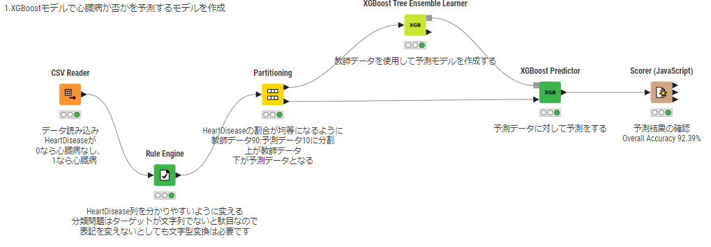
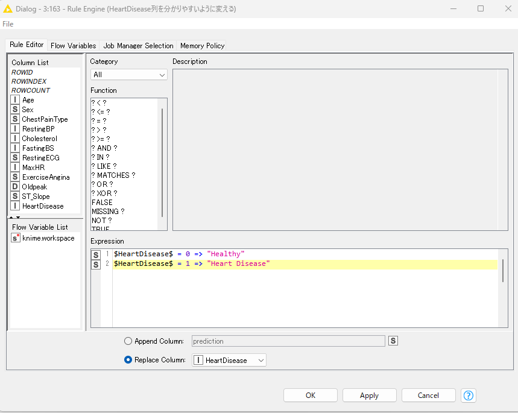
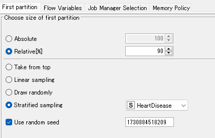
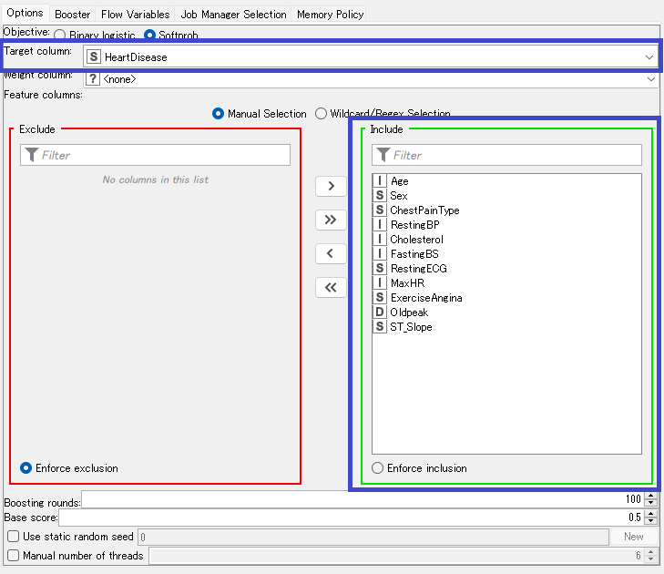
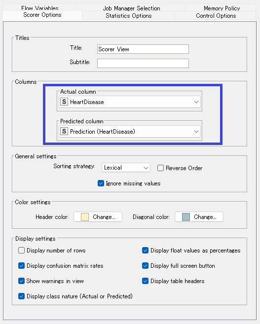
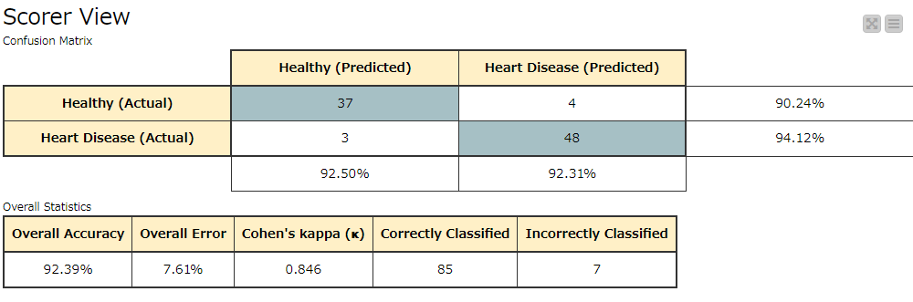

# KNIMEでGiskard拡張を使ってみる:実践編1

昨日の[導入編](1.md)から引き続き、担当はおびとです。よろしくお願い致します。

実戦編として本稿では Apple silicon MAC版 KNIMEのVer5.3.3、ModernUIを使用していきます。 
恐らく世に出ている最新パージョンは5.4.0と推察されますが本稿執筆時点ではまだリリースされていないのでー。 
もちろんWindows版でも問題無いですし、バージョン多少ズレてても大丈夫だとは思いますが、  
準備編でも触れたようにGiskard拡張はKNIME APのVer5.3.0以上が必要なのでそれ以下のバージョンをお使いの方は  
[こちら](https://www.knime.com/downloads)からダウンロード、インストールが必要かもしれません。[※1](#1)

## 用語の統一

昨日も触れましたがMLの分類問題を題材としてご紹介致します。  
使用する用語のすり合わせをした方が理解しやすいような気がしますので  
極簡単にですが本稿以降で使用する用語の定義をしておきましょう。

1. 分類問題	: 回帰問題のように具体的な数値予測を行うのではなくクラス分けで予測する問題。  
       例えば  Yes or No とか、High or Mid or Lowで予測するようなものは分類問題になる。  
2. 特徴量　	: 要素、属性。 例えば血液型のような選択肢から選ぶようなものはかっこつけてカテゴリカル、  
                                   身長のような数値が入るようなものはニューメリカルとかいったりする。  
4. XGBoost Tree Ensemble	:機械学習モデルの一種。なんかすごいやつ  
5. 教師データ	:機械学習モデルを作成する際に参考とする正解が含まれるデータ群  
6. 検証データ  :作成したモデルがどの程度すごいかを検証するためのデータ。こちらも正解を含む。  
7. Accuracy        :予測の正解率。100%なら全部当たってる。  
       0.1%とかならその予測モデル使うより鉛筆ころがしするのマジおススメ、というレベル。

ひとまずこの辺で。。。

## 環境の構築

機械学習モデルの検証でGiskard拡張を利用するにあたり、重要となるExtensionは以下の3種となります。

お好みの機械学習node群を使うためのExtension  
KNIME integrated Deployment  
KNIME Giskard Extension  

今回はXGBoost Tree Ensembleで予測モデルを作成してみようと思いますので  
KNIME XGBoost Integrationが該当します。  
Extensionのimport方法を解説しても良いのですがKNIMEはワークフローに含まれるノードの中で足りないものを  
自動で導入する機能がありますのでそちらを利用したいと思います。今回使用するワークフローを[こちら](https://hub.knime.com/s/JdP2MNsecFvmiNOs)  
に共有しておきますのでこちらをimportしてみて下さい。  
ワークフローを開いたときに自分の端末にinstallされていないExtensionを自動で検出して入れるかどうか聞いてきます。  
当然受け入れてinstallします。  

この辺やり方分からなければKD勉強会で毎週金曜日21:00より実施しているもくもく会で質問して下されば  
精一杯フォローさせて頂きますので是非参加をご検討下さいませ(宣伝)。

ちなみにExtensionのinstallに結構時間かかりますので一旦コーヒーブレイクでも挟みましょうか。[※2](#2)  

## まずは基本となる機械学習のフローを組む

Extensionのinstallが終了するとKNIMEの再起動要求がされます。  
指示に従って再起動後、改めてimportしたワークフローを開いてみます。無事に開けてますでしょうか。  

ワークフローの内容を確認してみます。  
もし何も表示されていなければCtrl+1かCtrl+2を押せば多分何とかなります。  
本稿では上段のフローを使っていきますので中、下段のフローは明日まで気づいていないフリをしていて下さい。

元データは[Just Knime It Season2-25で使用されたもの](https://hub.knime.com/alinebessa/spaces/Just%20KNIME%20It!%20Season%203%20-%20Datasets/Challenge%2025%20-%20Dataset~qYUNOwK3xBbnfYqC/)で
HeartDisease列が1の場合は心臓病で、0の場合には心臓病じゃない、  
というのを示しています。 
その他特徴量色々ありますが詳細は~~説明が面倒なので~~割愛します。    

HeartDisease列をターゲット、その他特徴量を全て使用してXGBoost Tree Ensembleで予測モデルを構築して  
その予測精度を検証する、というフローをざっと組んでありますね。

こうやって数個のnodeを繋げるだけで構築できるのはKNIMEならでは。  
まだGiskard拡張は使用されていませんがそもそも元のフロー作りが  
分かっていないといけませんのでね。

と、いうことで中身を確認していきましょうか。初手でデータを読み込みを行って、一旦Heart Diseaseの記載内容を  
Rule Engine nodeで書き換えています。 

 

心臓病ではない場合にはHealthy、心臓病の場合にはHeart Disease としました。  
数字ではなくて単語の方がこの後分かりやすいですからね。  
  
次、Partitioning nodeの設定みてみしょう。  
　

ここで上段に教師データ、下段に検証データとなるようデータを分岐させています。  
教師データに全体の90%、検証データに残りの10%となるよう振り分け指定していますかね。  

完全ランダムでは色々アレなのでHealthyとHeart Diseaseが同じ割合なるように振り分けて下さいね、としていて、  
誰がやっても結果が一緒にならないとややこしいことになるので毎回振り分け結果が一緒になるよう  
Use random seedにチェックが入れてあります。  
ランダムに振り分けたいのであればここのチェックは外しますが今回はそのままでー。 

  
予測モデル作成にはほにゃららLearner nodeを使いますので上段の教師データ側に今回作成するモデルに対応する  
XGBoost Tree Ensemble Learnerを繋いでありますね。(Regression)が付く方は回帰問題用なのでお間違いなく!!

設定を見てみると。。。

青枠で囲った部分が特に重要な設定項目ですかね。  

1. Target Column     :ターゲットを入れますのでHeartDisease列を指定します。
       ここは文字列である必要があるので  ターゲットが数値型の場合には予め変換しておく必要があります。
2. Feature columns  :予測に使う特徴量を指定します。
       ひとまず全部使ってみたいので全部Includeに入れてあります。   

 あとは色々設定できる部分もありますが本筋と違いますので今回は触ってません。  
実行することで予測モデルが作成され、そのモデルは灰色の■から出力されます。[※3](#3)

モデルができましたので予測データを使って実際に予測してみましょう。対応するほにゃららPredictorを使うと予測ができます。  
今回の場合はXGBoost Predictorが該当します。■側に作成したモデルを繋いで、▼側には検証データを繋ぎます。

実行結果を確認すると予測値の列が追加されていますのでその精度を確認するためにScore(JavaScript) nodeでOverall Accuracyを確認してみましょう。  

ここも特に重要な部分青枠で囲ってあります。多分最初からこうなってるはずですが念の為確認。

1. Actual column     :正解データが入っている列なので当然HeartDiseaseとなります。
2. Predicted column  :予測結果が入っている列なのでPrediction(HeartDisease)となります。 

設定が終わったらnodeをマウスカーソルでポイントしたときに出てくる虫眼鏡マークをクリックして。。。

なんと90%越え、かなり良さそうです!

と、ここで大分字数が多くなってきてしまいましたので今日はここまでにしましょう。  
明日はいよいよGiskard拡張の適用に入っていきます。  

#### 以下補足

---

<h5 id=1>※1</h5>
いかにもメールアドレス等の情報を入れてください、的な窓がありますが入力必須項目ではないので  
空欄のままで良くて、I have Read and ほにゃららのところにチェックを入れて、Downloadボタンをクリックするだけで大丈夫です。  

[戻る](#a)

<h5 id=2>※2</h5>
Giskardはpythonで動作しますのでKNIME Giskard Extensionをimportすると専用のpython環境が構築するのでちょう時間がかかるかと。  
その際、KNIMEがインストールされているディレクトリ下の  /bundling/root/pkgsに環境構築の残渣が残りますが、  
これらの残渣は削除をしても  動作に影響は無いので削除してしまえばディスク容量の節約ができる。  
、、、という夢を見たことがあります。(センシティブネタ

[戻る](#b)

<h5 id=3>※3</h5>
作成したモデルはModel Writer nodeで保存することができます。Model Reader  nodeで読みだすことができますので  
他のワークフローで使いまわすこともできますね。便利!

[戻る](#c)
