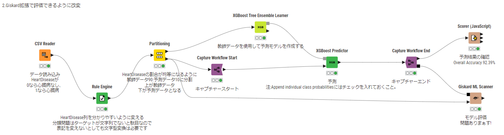
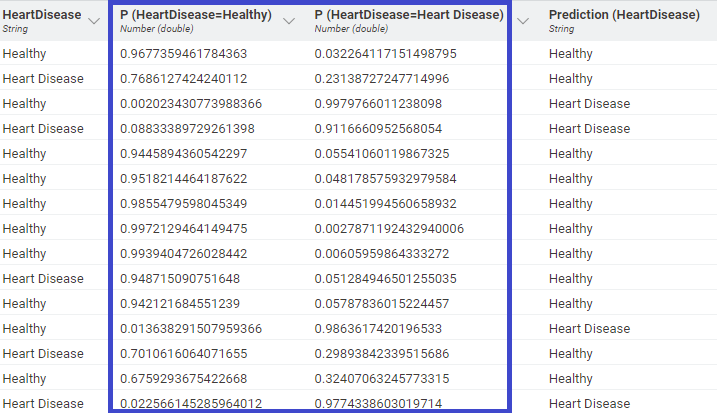
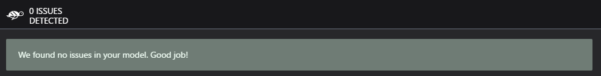
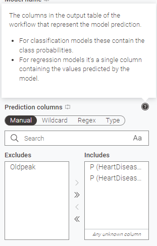

# KNIMEでGiskard拡張を使ってみる:実践編2

[導入編](1.md)、[実践編1](2.md)と来ましてまたまた担当はおびとです。本日が最終日となりますのでもう少々お付き合いくださいませ。  

先稿ではXGBoost Tree Ensembleモデルにより心臓病かどうかを分類問題として予測するモデルを作成しまして  
Accurcy 90%越えのものができました。  

本稿ではいよいよGiskard拡張を使ってモデルの評価をしていきたいと思います。    

## Giskard拡張の適用
KNIME Giskard Extensionのinstallに成功しているとGiskard ML Scannerというnodeが使用できるようになっています。  
これを作成したモデルと繋げると評価が出来るようになるのですがどう繋げたらいいのかがさっぱり分からない。どうしましょう。  

あ、なんか[昨日importしたワークフロー](https://hub.knime.com/s/JdP2MNsecFvmiNOs)を良く見てみると上手く使えるように修正されているフローがある!!

丁度いいのでこちらを使って確認していきたいと思います。

Giskard ML Scanner nodeへ確かに何かが繋がっています。よく確認してみると、、、  

下段の▼はPartitioning nodeで分けた検証データが。ここはまぁ良いでしょう。  
一方、上段の■は灰色ではなくて黒です。同じ形、同じ色で無いと繋ぐことは出来ませんから、  
どうしているかというとCapture Workflow で変換していますね。

Capture Workflow start と Capture workflow Endで挟んである区間の内容を記録してCaptured Objectとして分岐出力する、  
ということを利用してPredictorに適用されている予測モデル含めたなんやかんやをout側下段の■を経由して  
Giskard ML Scannerに渡している、ということですね。なるほど!上手く伝えられない!!  [※1](#1) ,[※2](#2)

Capture Workflowで挟まれた部分、一応設定を確認してみます。今回はPredictorだけしか挟んでいないのでPredictorの設定を見てみると

何やら Append Individual class probabilitiesにチェックが入っているようです。  
ここにチェックが入るとどうなんだろう。出力結果も見てみます。

予測結果だけではなくてどうやらそれぞれの分類について、正解である可能性を示す列が追加されるようですね。  
1が可能性100%、0が可能性0%、全部の可能性を足すと1になります。  
これが重要なんでしょうか?重要なんでしょうねぇ。

最後にGiskard ML Scanner nodeの設定確認してみましょう。

  
5か所青枠がありますね。

1. Model type	            : 分類問題を評価するのか回帰問題を評価するのか選択。分類問題の場合はCassificationですね。
2. Target column　	      : ターゲット。当然HeartDiseaseを選択。  
3. Classification labels	:どういう分類をしているかをカンマ区切りで記載。  
     今回だと　**Healthy,Heart Disease** 。スペースは気にしなくても良いっぽいです。  
     もし先稿で記載内容を変えていなかったのであればもちろん　**0,1**　でないと駄目。
5. Prediction columns	    :回帰問題であればモデルで予測された数値、分類問題であればそれぞれの分類になる可能性。  
     つまりはPredictorで新たに追加した列を入れると。やっぱり重要だった。 [※3](#3)
6. Feature columns        :予測に使用した特徴量。正解が入っているHeartDisease列は抜いておくことをお忘れなく。

## モデル評価

さぁ設定ができました。実際に処理してみると。。。  

なんかRobustnessの項目にISSUESが出てるー!  [※4](#4)  

Show Detailsをクリックしたりなんかしてみながら内容を確認してみると何やらChestPainTypeとST_Slopeが  
大文字か小文字かで結果が  変わるのでまったく問題ないわけでは無いよね、ということのようです。  
なのでAccuracyは高いけども場合によっては修正した方が無難ですねということが判断できました。  
これが、これこそが、Giskard拡張を使うことで新たにできるようになることなのでした。

## 感想

いやー長かったですねー。でも実務上は2分くらいで適用できますしKNIMEで機械学習組むなら  
Giskard拡張使わない理由があんま無いと思うんですよね。  
ここはもっとアピールしても良いところだと思う。ホント。

他にもWorkflow Reader で読みだす方法でも大丈夫だったりします。  
ただ、機械学習の場合フローの収まりがあまり良くないのでこちらは却下しました

ちなみに今回RobustnessにだけISSUESが出るように調整しましたけども教師データと検証データを70:30で分けたりすると  
もっと豪快に色々出てきたりするのでこの拡張の良さがもっと良く分かると思います。是非お確かめあれ。

## WRAP UP

Giskard拡張すごい!便利!!ということを無駄に3日間も掛けてお送りしてきましたが流石にお時間のようです。  
乱筆乱文ではありましたが何となくでも便利そう、と感じて下さった方がいらっしゃいましたら幸いです。  

さて、そろそろおじサンタとして娘、息子に夢を届ける準備に入りたいと思います。  
少し早いですか以下の言葉で締めさせて頂きましょう。

# メリークリスマス!　そして良いお年を!

## おまけ

今回の例でもISSUESを解決する方法は何通りかあるわけですが、恐らく一番楽な方法で対処したのが残った下段のフローで、評価結果は

となります。~~Accuracy下げるけども~~。皆様方におかれましては是非おびとからのクリスマスプレゼントと捉えて  
プチJUST KNIME IT! としてもっとAccuracyを高い状態で改善できる方法を探してもらえたらと思います。  
そしてよりいい方法が見つかったら是非共有を!オナシャス!!

#### 以下補足

---

<h5 id=1>※1</h5>

ModernUIを使っている場合Nodeに生えているコネクタをマウスポイントすると何を繋ぐ必要があるか教えてくれたりします。  
Giskard ML Scanner nodeのin側にマウスポイントしてみると上段■はPrediction Workflow、下段の▼はValidation Dataだよ?と出ますね。  
また、今回の例以外でもWorkflow Reader nodeで読みだす方法でも上手くいったりしますが、個人的にはCaptureで挟む方が分かりやすい気がしましたのでこちらを採用しています。

[戻る](#a)

<h5 id=2>※2</h5>

今回使用したCapture系node以外でも、一部nodeの中にはコネクターがないものがあります。Modern UIであればこまけぇこたぁいいんだよ!  
と強引に繋いでしまえば自動認識して対応するコネクタが生えてくるハズ。。。  

[戻る](#a)

<h5 id=3>※3</h5>

↓にしかこのことに関する記載無いと思います。ここはK-AIに問うても教えてくれない感じです。

  

[戻る](#b)

<h5 id=4>※4</h5>

あまりどかどか問題があっても分かりにくいかと思いまして今回は1項目だけエラーが出るように調整してありますが、  
実際はPerformance bias,Robustness,Overconfidence,Underconfidence,Unethical behaviour,Data leakage,Stochasticity  
の7項目について評価されています。複数項目でエラーが出るとタブが増えていくー。

[戻る](#c)

